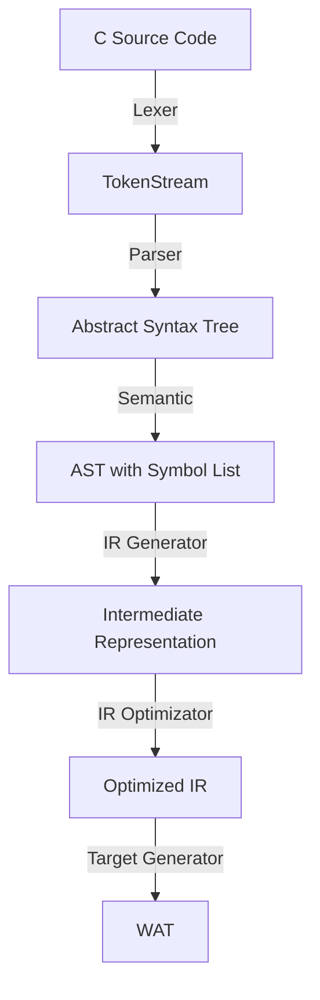

## 前言

为什么会有 NCC (Nashell C Compiler) 这个项目？这个得从 Nashell 这个项目说起。这个项目是我的个人网站项目，并不是一个真实操作系统的 Shell 项目，我主要是想像终端在浏览器中展示我的个人信息和作品集。因此我基于 [Lifo-sh](https://lifo.sh) 提供的基础的终端交互模拟环境开发了 Nashell 项目。Lifo-sh 已经带有很多的 Linux 操作系统的基础组件，例如，Shell、VFS、常用 Linux 命令。为了能更加可视化的形式展示某些内容，我为 Nashell 开发了窗口组件和窗口管理模块，以实现对 html 文本的渲染。

我是真的打算给这个“浏览器操作系统”赋予一个操作系统的全部能力，所以我就在寻思着要不要给它写一个 **C 语言编译器**。

为什么不是其他的语言？因为对于一个计算机相关专业的同学而言，或者是学过计算机语言课程的同学来说，C 语言是大家最先学会的语言，可能有人不会其他的语言，但是一定会 C 语言。我希望大家都能去游玩这个*操作系统*，所以我决定去实现一个基于 C99 标准的 C 语言编译器。

这个编译器运行在 wasm 环境中，将 VFS 中的 C 语言文件编译为 wasm 二进制可执行文件。为了保证安全性，只会暴露最小的 API，通过 JS 对象传入 wasm 实例中，借助 wasm 的沙盒机制实现隔离。

开发这么一个 C 语言编译器是还有其他的原因的，因为我个人是做编译器和运行时相关的研究的，以及部分操作系统相关的工作，所以我就想，要不要实现一个 C 语言编译器来作为作品。

所以对于 NCC 的定义我是这样的：在 wasm 平台原生运行的，追求极致性能的微型 C 语言编译器 (TCC)，主要的面向对象是边缘计算领域。目前这个领域还没有完全 100% 相同的竞品。

不过归根到底，NCC 只是一个我的个人学习作品，说不定也不会走得特别远，但是至少先把构建流程跑通吧。

## 编译管线设计

对于这样的编译器项目，我的初步设计还是遵循其他的成熟编译器的架构设计：



目前只完成了源文件到 TokenStream 的流程，现在正在研究如何实现 Parser。所以这个博客集中汇报前两层的架构设计，即 Lexer 和 PreProcessor。

---

## 一、核心抽象

整个编译管线的基石是一个简洁的 trait：

```rust
pub trait TokenStream {
  fn peek(&mut self) -> Option<&Token>;
  fn next(&mut self) -> Option<Token>;
  fn pos(&self) -> usize;
}
```

**Lexer** 和 **PreProcessor** 都实现了这个 trait。这意味着 Parser 完全不需要直到它消费的 token 流来自原始源码还是经过预处理展开的结果，它只跟 `Box<dyn TokenStream>` 打交道。

这是一个典型的**深模块**，但是背后隐藏了完全不同的 token 生成策略：

- Lexer 的 `next()`：每次从 Cursor 读取字符，按 C 标准 token 化。
- PreProcessor 的 `next()`：从 Lexer 栈读取 token，检查是否需要宏展开或跳过条件编译分支。

Parser 通过这层抽象可以完全不感知预处理器是否存在。

## 二、架构分层

### 1. Cursor 层

`cursor.rs` 是最底层的组件，是一个字符级别的迭代器。它包装 `Rc<String>`，提供字符级别的流式访问。

```rust
pub struct Cursor {
  source: Rc<String>,
  file_id: usize,
  pos: usize,
}
```

上面的代码中有这样的几个设计：

- `Rc<String>` 共享源码： `SourceManager` 持有 `Rc<String>` 的单一副本，`Cursor` 借用引用，同时支持多个 Lexer 在预处理器嵌套文件时共享同一份源码，无须拷贝。整个程序运行的周期每个文件只会有一份完整的源代码被放进内存中。
- Line-splice 内联处理：C 标准规定反斜杠换行必须在词法分析的第一阶段被消去。Cursor 在 `peek()` 和 `bump()` 内部自动跳过 line-splice，上层 Lexer 完全无感。
- Checkpoint / Restore：支持保存和恢复位置，以供 Lexer 在需要试探性解析时使用。

### 2. Token 层

`token.rs` 定义了编译器的通用语义单元。有下面几点的设计：

1. SourceLocation

```rust
pub struct SourceLocation {
  pub file_id: usize,
  pub offset: usize,
}
```

所有的 token 都携带这个位置，错误报告可以精确到哪个文件的哪个字节。行号由 `SourceManager::offset_to_line_col` 按需计算，不在 token 中冗余存储。

2. TokenFlag

使用 `bitflags` 库为每个 token 附加元信息：

  - `KStartOfLine`：该 token 是首行第一个 token
  - `KLeadingSpace`：该 token 前有空白字符
  - `KDisableExpanding`：禁止宏展开
  - `KNeedCleaning`：需要清理
  - `KHasError`：该 token 包含解析错误

这里的亮点是**错误即 token**原则。词法错误不会中断 token 化流程，而是产生一个带有 `KHasError` 标记的 token，错误信息会被收集到 `DiagnosticBag` 中，解析可以继续。这个模式沿用到了 Parser 层。

### 3. Lexer 层

`lexer.rs` 实现 `TokenStream`，核心方法 `advance()` 的内部循环：

1. 调用 `lex_raw_token()` 从 Cursor 消费字符
2. 如果 token 是 `KNewLine` 或 `KWhiteSpace`，更新 `start_of_line` / `leading_space` 标记
3. 重复直至遇到真正的 token（非空白/换行）
4. 在真实 token 上附加 `KStartOfLine` 或 `KLeadingSpace` 标记

#### `lex_raw_token()`

解析 token 采用的是 TokenKind 优先的理念，从首字母识别后来分发到各自的函数进行处理。对于模式匹配的结果，每个 `TokenKind` 只会有一次机会出现，同时先后顺序安排上也是长 token 优先的模式。

数字解析器采用"pp-number 预抓取"策略（模仿 C 预处理期的数字规则），先贪婪读取连续数字字母和 `.`，然后统一解析，尝试整数解析失败则回退到浮点数路径。错误信息按 `Diagnosable` trait 结构化为可报告的对象。

### 4. SourceManager

预处理器支持 `#include`，这意味着 Lexer 需要同时管理多个源文件。所以我设计了 `SourceManager` 负责：

- 注册源文件，返回 `file_id`。
- 通过 `offset_to_line_col(usize, usize) → (usize, usize)` 将字节偏移量转换为行列号。
- `get_source(usize) → Rc<String>` 返回共享的源码引用。
- `get_file_dir(usize) → Option<&Path>` 返回文件所在目录，用于解析相对路径。

### 5. PreProcessor

预处理器是架构中最复杂的部分。它用 **Lexer 栈** 实现文件包含，用 **token 缓冲区** 实现宏展开。

#### 主循环

1. 检查 token_buffer，有就立即返回。这是宏展开的产出
2. 从当前活动的 Lexer 获取下一个 token
3. 如果当前 Lexer 已到达文件末尾，就弹栈，然后回到上一个文件
4. 如果处于条件编译跳过模式，调用 skip_process() 维护 if_stack
5. 检查是否是 `#` 开头，调用 handle_directive()
6. 检查是否是标识符，尝试宏展开
7. 返回 token

#### Lexer 栈与文件

```plaintext
顶层: main.c 的 Lexer         ← PreProcessor 从这取 token
    ├── #include "foo.h"      → push foo.h 的 Lexer
    │   ├── #include "bar.h"  → push bar.h 的 Lexer
    │   │   └── (EOF)         → pop bar.h
    │   └── (EOF)             → pop foo.h
    └── 继续消费 main.c
```

当 `#include` 指令被处理时，`SourceManager` 创建一个新文件记录，`Lexer::new()` 为该文件创建词法分析器，然后 push 到 `lexer_stack` 顶部。文件结束后 pop，回到包含它的文件。`if_balance` 向量跟踪每个文件进入时的条件编译栈深度，用于检测跨文件的 `#if`/`#endif` 不匹配。

#### 宏展开

当前仅支持对象式宏（object-like macros）。展开过程在 `expand_object_macro()` 中递归进行：

1. 将被展开的宏名加入 `expanding` 集合，以防止递归展开死循环
2. 遍历宏体的每个 token
3. 如果是标识符且是已定义的宏名，就递归展开，结果注入 token_buffer 的前端
4. 处理完毕后从 `expanding` 集合中移除

预定义宏 `__LINE__` 和 `__FILE__` 在运行时根据当前 token 的位置动态生成值。

#### 条件编译

`IfState` 枚举跟踪条件编译栈的状态：`Active` / `Skipping` / `Seen`。当 PreProcessor 在跳过模式时，`skip_process()` 仅维护 `if_stack`，所有其他 token 被静默丢弃，这确保了嵌套条件编译的正确性。

#### 错误恢复

`#include`、`#define`、`#ifdef` 等指令在遇到语法错误时调用 `skip_to_end_of_line()` 跳过当前行剩余内容，避免单个错误导致后续 token 全部错位。

## 三、外部 I/O 抽象

### 1. 跨平台编译

编译器同时运行在 native 环境（测试）和 Wasm 环境（生产），所有与环境交互的行为都通过 trait 抽象：

```rust
pub trait CompilerHost {
    fn write_stdout(&mut self, data: &[u8]);
    fn write_stderr(&mut self, data: &[u8]);
    fn flush(&mut self);
    fn fatal(&mut self, msg: &str) -> !;
}
```

两个后端通过条件编译选择：

| 后端 | 平台 | stdout | stderr | fatal |
| ---- | ---- | ------ | ------ | ----- |
| NativeHost | `cfg(not(wasm32))` | `println!` | `eprintln!` | `std::process::abort()` |
| WasmHost | `cfg(wasm32)` | 内部 buffer | 内部 buffer | `panic!` (后续使用 JS 异常) |

通过全局静态 + `with()` / `with_mut()` 访问，避免将 `Box<dyn CompilerHost>` 贯穿每个 API。

### 2. 文件系统抽象

```rust
pub trait FileSystemTrait {
    fn read_file(&self, path: &str, base_dir: Option<&Path>) -> Result<String, String>;
}
```

- `NativeFileSystem` — 真实文件系统操作
- `MockFS` — 测试中用的 HashMap 模拟文件系统

## 四、诊断系统

`DiagnosticBag` 是编译器中流动的"错误收集器"。

```rust
pub struct DiagnosticBag {
    diagnostics: Vec<Diagnostic>,
    pub has_error: bool,
}
```

设计原则：**解析不因第一个错误而停止**。错误信息被收集到 bag 中，解析器继续产生 token。顶层调用方在解析完成后一次性检查所有诊断。

```rust
pub trait Diagnosable: std::fmt::Debug {
    fn message(&self) -> String;
    fn location(&self) -> SourceLocation;
    fn into_diagnostic(&self, level: DiagnosticLevel, file_id: usize) -> Diagnostic { ... }
}
```

每个可报告的错误实现 `Diagnosable` trait，最终通过 `Diagnostic::to_string(&SourceManager)` 格式化为 `[level] (file:line:col): message` 的标准输出。

## 五、测试策略

整个 lexer 层有 **40+ 个测试**，覆盖：

- **Cursor 单元测试**：line-splice 消去、checkpoint/restore。
- **Lexer 测试**：所有关键字 token 化、数字字面量（含错误路径）、字符串/字符转义、注释消去、标点符号最大匹配、token 行首/空白标记。
- **PreProcessor 测试**：`#define` / `#undef`、`#ifdef` / `#ifndef` / `#else` / `#endif` 嵌套、预定义宏展开、`#include` 文件包含、递归宏展开保护、错误恢复。

目前的测试项目还是偏少的，未来会加入更多的测试。

| 模块 | 状态 | 说明 |
|------|------|------|
| Cursor | 已完成 | 字符迭代器，line-splice，checkpoint |
| Token 定义 | 已完成 | 完整 C token 集合，位标记 |
| Lexer | 已完成 | 完整 token 化，错误 token 化 |
| SourceManager | 已完成 | 多文件管理，行/列计算 |
| PreProcessor | 已完成 | 宏展开，条件编译，文件包含 |
| Parser（声明部分） | 骨架已完成 | 递归下降 + Pratt（表达式部分待填充） |
| Semantic Analysis | 未开始 | |
| Codegen (Wasm) | 未开始 | |

Parser 的递归下降和 Pratt 表达式解析器正在填充中。Parser 完全基于 `TokenStream` trait 构建，不需要感知它消费的是原始 Lexer 还是 PreProcessor。这正是整个架构设计中最值得自夸的 seam。

---

_本文是 nashell-cc 编译器系列的第一篇。下一期将深入解析器——递归下降声明解析与 Pratt 表达式解析的协同设计。_
